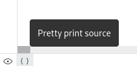

# Webfuzzing and content discovery
## Web resources
- https://www.base64decode.org/
- https://www.base64encode.org/
- https://gchq.github.io/CyberChef/
- https://crackstation.net/
- https://archive.org/web/


## Manually scan/enumerate site with browser
View the page source, look for:
- Comments by developers,
- Frameworks and versions used,
- Links to other part of the server,
- Assets used, directories, test for directory listing.

If something is visually blocking text or images, like a div/css blocker. Edit the css style in Inspector to display it differently(like 'display:none;').

Get common files for website:
- robots.txt
- favicon
- sitemap.xml

View standard headers for pages, look for service names and versions. Use firefox devtools, burpsuite or 'curl -v'.

## LFI/RFI/Path traversal
Getting around filtering:
- ../
- ....//
- Nullbyte, 0x00(hex), %00(URL)
- Current dir trick, ./
- Force dir, forced-dir/../../../

In PHP versions before 5.3.4 you can end a string with a null byte(%00), which may remove file extensions that are added server side (Do it after URL encoding ;). This might also work to get around filtered keywords.

### OSINT

Use **google engine** to search through site.
- https://en.wikipedia.org/wiki/Google_hacking

site:tryhackme.com admin(search for admin on this site)

inurl: (search for admin in URLs)

filetype:pdf admin (search for pdfs with admin)

intitle:admin (search fo admin in title)

Use **wayback machine** to see earlier versions:
- https://archive.org/web/

Check the site with **Wappalyzer** to identify technologies used(online or firefox extension).

Search the company name on **github** to see if any public repisotories exist.

Check for **Amazon S3 buckets** in source and elsewhere too see if there's more information.

*http(s)://{name}.s3.amazonaws.com*

## Automation tools general
## dirsearch.py
`pip install dirsearch`

`dirsearch.py -u [ip] -e toools/webext.txt -o scans/dirs-init --format=md`
## gobuster
`gobuster [dir | dns | vhost]`

## dirbuster
`dirb [url] [wordlist]`

## ffuf
`ffuf -u http://ADDRESS.com/FUZZ -w mywords.txt:FUZZ`

```
-u URL/FUZZ
-w WORDLIST/FUZZ
-H "[HEADER]"
-of md # Output format markdown
-o FILE # Output to file
-t NR # Threads
```

## HTTP automation examples
### Username enumeration
**ffuf**:

`ffuf -u http://10.10.45.53/customers/signup -w SecLists/Usernames/Names/names.txt -X POST -d "username=FUZZ&email=x&password=x&cpassword=x" -H "Content-Type: application/x-www-form-urlencoded" -mr "An account with this username already exists"`

**hydra**:

`hydra -L SecLists/Usernames/Names/names.txt -p x 10.10.45.53 http-post-form "/customers/signup:username=^USER^&email=x&password=x&cpassword=x:S=An account with this username already exists"`

### Password brute
**ffuf**

`ffuf -u http://10.10.45.53/customers/login -w ab-users.txt:W1,../SecLists/Passwords/Common-Credentials/10-million-password-list-top-100.txt:W2 -X POST -d "username=W1&password=W2" -H "Content-Type: application/x-www-form-urlencoded" -fc 200`

**hydra**
`hydra -L ab-users.txt -P ../SecLists/Passwords/Common-Credentials/10-million-password-list-top-100.txt 10.10.45.53 http-post-form "/customers/login:username=^USER^&password=^PASS^:Customer Login"`

## Firefox
- CTRL+SHIFT+E = Developer tools
- Put 'view-source:' before address to get source.
- Use addon foxyproxy to quickly change between proxies(like burp).
- To tamper with cookie values, check the storage tab.

### Debugger
To view javascripts, go to debugger(or source in chrome).

To make it more easily readable when everything is one line use this button:



To insert a breakpoint in the javascript code, click on the line number so that it turns blue.


### Network
To view all requests sent and recieved, use the network tab. Here you can see and copy all the POST request that you make and also view the responses.
